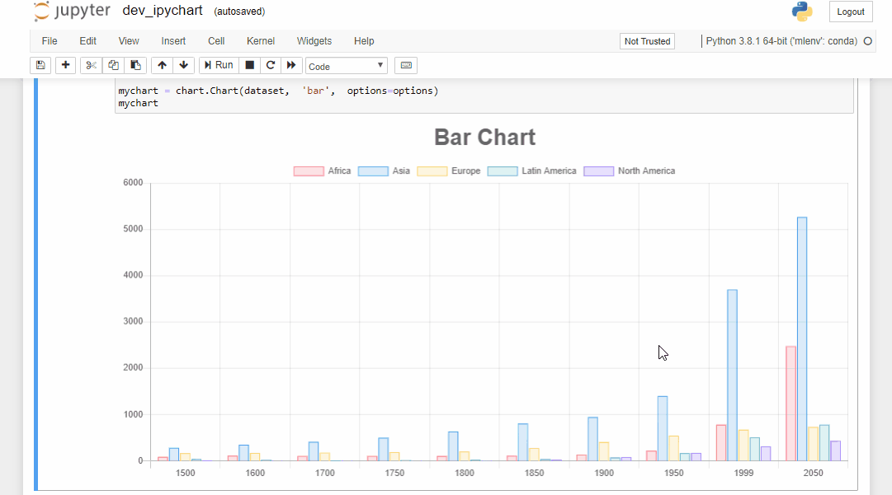

ipychart
===============================

*Wrapping the great [**Chart.js**](https://www.chartjs.org/) library into a jupyter [**ipywidget**](https://github.com/jupyter-widgets/ipywidgets): harness the power of Chart.js in the famous python jupyter notebook environment !*

Installation
------------

To install use pip:

    $ pip install ipychart
    $ jupyter nbextension enable --py --sys-prefix ipychart

Usage
------------

Create charts with python in a very similar way to creating charts using Chart.js ([create a bar chart using Chart.js](https://www.chartjs.org/docs/latest/charts/bar.html)):

    dataset = {
        'labels': [1500, 1600, 1700, 1750, 1800, 1850, 1900, 1950, 1999, 2050], 
        'datasets': [
            { 'data': [86, 114, 106, 106, 107, 111, 133, 221, 783, 2478], 'label': "Africa", }, 
            { 'data': [282, 350, 411, 502, 635, 809, 947, 1402, 3700, 5267], 'label': "Asia"}, 
            {'data': [168, 170, 178, 190, 203, 276, 408, 547, 675, 734], 'label': "Europe"}, 
            {'data': [40, 20, 10, 16, 24, 38, 74, 167, 508, 784], 'label': "Latin America"}, 
            {'data': [6, 3, 2, 2, 7, 26, 82, 172, 312, 433], 'label': "North America"}
            ]
        }

    options = {'title': {'display': True, 'text': 'Bar Chart', 'fontSize': 30}}

    mychart = chart.Chart(dataset,  'bar',  options=options)
    mychart

The charts created are fully configurable, interactive and modular and are displayed in the output of the the cells of your jupyter notebook environment:

All the types of charts present in chart.js are exposed:

- Line
- Bar
- Horizontal Bar
- Radar
- Doughnut
- Polar Area
- Bubble
- Pie

Development Installation 
------------

For a development installation (requires npm),

    $ git clone https://github.com/nicohlr/ipychart.git
    $ cd ipychart
    $ conda install jupyterlab nodejs -c conda-forge
    $ cd ipychart/js
    $ npm install 
    $ cd .. 
    $ pip install -e .
    $ jupyter nbextension install --py --symlink --sys-prefix ipychart
    $ jupyter nbextension enable --py --sys-prefix ipychart

References
------------

- https://ipywidgets.readthedocs.io/en/latest/examples/Widget%20Custom.html
- https://blog.jupyter.org/authoring-custom-jupyter-widgets-2884a462e724
- https://dgothrek.gitlab.io/ipyaggrid/
